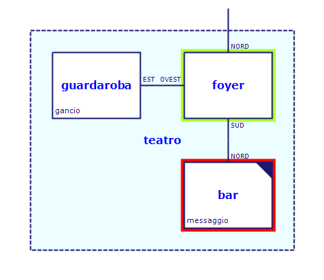

# Cloak of Darkness

Implementazione italiana in Alan di _Cloak of Darkness_, di Roger Firth, considerata la «Stele di Rosetta» delle avventure testuali.

http://www.firthworks.com/roger/cloak/

-----

**Indice dei contenuti**

<!-- MarkdownTOC autolink="true" bracket="round" autoanchor="false" lowercase="only_ascii" uri_encoding="true" levels="1,2,3" -->

- [Introduzione](#introduzione)
- [Indice dei file](#indice-dei-file)
    - [Sorgenti avventura](#sorgenti-avventura)
    - [Mappa](#mappa)
    - [Documentazione](#documentazione)
    - [Script di automazione](#script-di-automazione)
    - [Script di comandi e log](#script-di-comandi-e-log)

<!-- /MarkdownTOC -->

-----

# Introduzione

_Cloak of Darkness_ è una breve avventura testuale ideata da [Roger Firth] come esercizio da implementare nelle varie piattaforme per la scrittura di AT. Esistono versioni di _Cloak of Darkness_ per tutte le piattaforme di IF più note, e anche per sistemi di sviluppo meno noti.

Questa edizione italiana è stata realizzata da Tristano Ajmone e S3RioUs JokER partendo dalla [versione in Alan] creata da [Stephen Griffiths], in seguito convertita ad Alan 3 da [Thomas Nilefalk]  (all'epoca, Thomas Nilsson). La maggior parte del codice originale è stato riscritto poiché la versione di Griffiths impiegava una liberia esterna (lib 0.6.1) per l'implementazione dei verbi comuni.

Nell'opera di adattamento, si è inoltre preso spunto ed attinto dai sorgenti delle varie implementazioni di _Cloak of Darkness_ in altri sistemi (Inform 6/7, TADS 2/3, Hugo), di modo da avere una visione complessiva del progetto.

Per il supporto della lingua italiana viene usato solo il modulo __Alan Italian__ ([`lib_grammatica.i`][lib_grammatica]), e non l'intera __Libreria Standard Italiana__. Quindi, quest'avventura offre un esempio di come creare una AT italiana usando «Alan nudo e crudo» e costruendo da zero tutti i verbi di base.

# Indice dei file

## Sorgenti avventura

- [`cloak_darkness.alan`](./cloak_darkness.alan)

> __IMPORTANTE__ — Per una corretta compilazione di quest'avventura, verifica nei commenti del file sorgente la versione minima del compilatore Alan richiesta.

## Mappa

- [`cloak_mappa.png`](./cloak_mappa.png) — mappa sorgente dell'avventura, creata con [Trizbort].
- [`cloak_mappa.trizbort`](./cloak_mappa.trizbort) — mappa esportata in formato immagine.

## Documentazione

È disponibile la documentazione del codice sorgente annotato di _Cloak of Darkness_:

- [`cloak_darkness.html`](./cloak_darkness.html) ([Anteprima HTML Live])
- [`cloak_darkness.adoc`](./cloak_darkness.adoc)

[Anteprima HTML Live]: http://htmlpreview.github.io/?https://github.com/tajmone/Alan3-Italian/blob/master/demo/cloak/cloak_darkness.html "Vedi il documento HTML tramite GitHub & BitBucket HTML Preview"

Il progetto originale di _Cloak of Darkness_ prevede infatti di annotare il codice sorgente dell'avventura, affinché le edizioni dell'avventura realizzate su diversi sistemi di sviluppo possano essere studiate e comparate tra loro, rendendo _Cloak of Darkness_ una sorta di «Stele di Rosetta delle AT».

Le versioni in HTML e AsciiDoc del sorgente sono più leggibili, e la versione HTML offre anche la colorazione sintattica del codice Alan, semplificandone ulteriormente lo studio.

Entrambi i documenti sono generati automaticamente dai commenti nel file sorgente (vedi sotto).

## Script di automazione

Il seguente batch script gestisce tutte le operazioni di automazione di _Cloak of Darkness_:

- [`cloak_darkness.bat`](./cloak_darkness.bat)

Nello specifico, lo script esegue i seguenti compiti:

1. Compila l'avventura.
2. Esegue su di essa tutti gli script di comandi.
3. Estrae la documentazione dai sorgenti dell'avventura.

Per semplificare la manutenzione del progetto ho voluto utilizzare uno script unificato per tutte le operazioni. 

> __NOTA__ — La creazione della documentazione richiede la presenza sul sistema di ulteriori strumenti ([Doxter] e [Asciidoctor]), ma il terzo passaggio è da considersi opzionale e, in assenza dei suddetti applicativi, lo script si limiterà a segnalare un errore, senza che ciò comprometta in alcun modo la compilazione e l'esecuzione degli script.

Il sistema di automazione della documentazione coinvolge altri due documenti intermedi, uno creato manualmente (il template), l'altro auto-generato da [Doxter]:

- [`cloak_darkness.adoc`](./cloak_darkness.adoc) — documentazione AsciiDoc autogenerata da Doxter.
- [`cloak_template.adoc`](./cloak_template.adoc) — template di supporto per la conversione da AsciiDoc a HTML.

Per la documentazione del codice dell'avventura viene impiegato [Doxter], uno strumento in grado di estrarre la documentazione dai commenti nel codice sorgente e produrre un documento AsciiDoc, che viene poi convertito in un documento HTML ben formattato tramite [Asciidoctor] e [Highlight]. 

Per maggiori informazioni, visitare il [sito di Doxter].

## Script di comandi e log

- [`soluzione.a3sol`](./soluzione.a3sol)/[`.a3log`](./soluzione.a3log) — soluzione minima del gioco.
- `*.a3sol`/`*.a3log` — test vari.

I file con estensione `.a3sol` sono script di comandi per simulare/testare partire sull'avventura compilata, eseguiti tramite lo script batch. I file con estension `.a3log` contengono le trascrizioni delle sessioni di gioco automatizzate generate dagli scripti di comandi.

Il batch di automatizzazione `cloak_darkness.bat`, dopo aver compilato l'avventura sorgente, eseguira ogni script `.a3sol` in questa cartella, producendo in automatico una trascrizione della partita avente lo stesso nome file dello script ma con l'estensione `.a3log`:

    <nome file>.a3sol   -->   cloak_darkness.a3c   -->   <nome file>.a3log

<!-----------------------------------------------------------------------------
                               REFERENCE LINKS                                
------------------------------------------------------------------------------>

[versione in Alan]: http://www.firthworks.com/roger/cloak/alan/index.html

[Roger Firth]: http://www.firthworks.com/roger/index.html
[Stephen Griffiths]: http://users.actrix.co.nz/stevgrif/
[Thomas Nilefalk]: https://github.com/thoni56 "Visita il profilo GitHub di Thomas Nilefalk/Nilsson"

[lib_grammatica]: ../../alanlib_ita/lib_grammatica.i "Vedi sorgente del modulo"

[Cloak of Darkness]: http://www.firthworks.com/roger/cloak/

<!-- 3rd Party Tools -->

[Doxter]: https://github.com/tajmone/doxter "Visita il repository di Doxter"
[sito di Doxter]: https://git.io/doxter "Visita il sito di Doxter"
[Asciidoctor]: https://asciidoctor.org "Visita il sito di Asciidoctor"

[Trizbort]: http://www.trizbort.com/ "Visita il sito di Trizbort"
[Highlight]: http://www.andre-simon.de/ "Visita il sito di Highlight"

<!-- EOF -->
