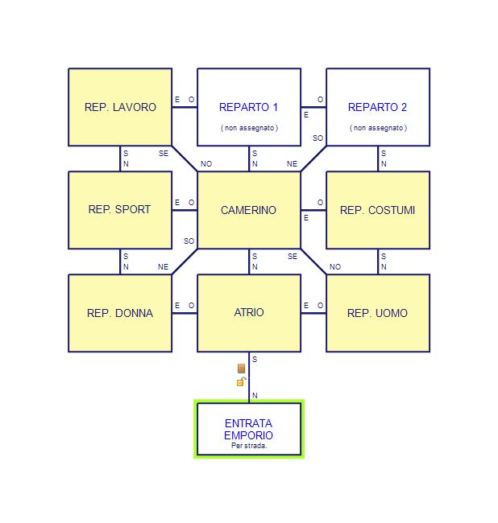

// tag::rev_info[]
:revdate:     2019-02-20
:revnumber:   Alpha
:AlanSDK:     Alan 3.0beta6 build 2015
// end::rev_info[]
// tag::region1[]
*Emporio Giorgio Alani* by Tristano Ajmone, 2018.
Un'avventura per testare le funzionalità del vestiario di Alan-Italian.

// end::region1[]
// tag::region2[]
== Personalizzazione classe `location`

Aggiungiamo a tutti i luoghi alcuni attributi personalizzati:

1. Un attributo stringa per definire un nome alternativo per la stanza, da
   mostrare quando la si menziona nei messaggi. Di solito, si tratta di una
   versione più breve del nome originale, tutto in minuscolo. Attualmente è
   utilizzato dall'EVENTo `Riattiva_Assistente`, per menzionare da quale
   stanza è arrivata (se la stringa è vuota, verrà usato `LOCATION OF`).

2. Un attributo stringa per immagazzinare la lista delle uscite di una stanza.
   Attualmente utilizzato dal verbo `mostra_uscite`.

[NOTE]
============================================================================
In questa avventura definiremo anche l'articolo in quelle stanze cui verrà
fatto riferimento nei messaggi di `Riattiva_Assistente`, così sarà possibile
recuperare le preposizioni articolate idonee al nome della stanza tramite
`prep_DA`, ecc. (es. "`dall'atrio`").
============================================================================

[source,alan]
--------------------------------------------------------------------------------
ADD TO EVERY location
  HAS menzione_stanza "".   -- (opzionale) nome alternativo nei messaggi.
  HAS uscite_stanza   "".   -- (opzionale) elenco uscite della stanza.
END ADD TO location.

--------------------------------------------------------------------------------

== MAPPA DEL GIOCO

Iniziamo ad abbozzare la mappa del gioco, ci occuperemo dell'arredamento più
avanti, per rendere più leggibile il codice.

=== Entrata Emporio GA

[source,alan]
--------------------------------------------------------------------------------
THE ega_entrata IsA luogo_esterno.
  NAME 'Davanti all''Emporio Alani'.
  EXIT nord TO ega_atrio
    DOES
      --------------------
      -- Porte Automatiche
      --------------------
      SAY ega_porte:testo_attraversa.
      LOCATE ega_porte AT ega_atrio.
      LOCATE ega_telaio_porte AT ega_atrio.
      -----------------------
      -- Assistente Personale
      -----------------------
      MAKE assistente_ega seguendo.
  END EXIT.
  DESCRIPTION "Ti trovi di fronte all'entrata dell'Emporio Giorgio Alani."
  HAS uscite_stanza "NORD per entrare nell'Emprio.".
END THE ega_entrata.

--------------------------------------------------------------------------------

=== Atrio dell'Emporio

[source,alan]
--------------------------------------------------------------------------------
THE ega_atrio IsA stanza.
  NAME 'Atrio dell''Emporio Alani'.
  HAS menzione_stanza "atrio".
  HAS articolo "l'".   --> Per una corretta inizializzazione delle preposizioni!
  EXIT est   TO ega_uomo.
  EXIT ovest TO ega_donna.
  EXIT nord  TO ega_camerino.
  EXIT sud   TO ega_entrata
    DOES
      --------------------
      -- Porte Automatiche
      --------------------
      SAY ega_porte:testo_attraversa.
      LOCATE ega_porte AT ega_atrio.
      LOCATE ega_telaio_porte AT ega_atrio.
      -----------------------
      -- Assistente Personale
      -----------------------
      MAKE assistente_ega NOT seguendo.
      "L'assistente ti saluta mentre lasci l'emporio."
  END EXIT.
  DESCRIPTION
    "Questo lussuoso atrio conduce ai vari reparti dell'emporio."
  HAS uscite_stanza
    "EST al reparato uomo, OVEST al reparto donna, e NORD al camerino.".
END THE ega_atrio.

--------------------------------------------------------------------------------

=== Camerino
Collochiamo il camerino al centro dell'emprio (che è quadrato) di modo che
sia accessibile da tutti i reparti.

[source,alan]
--------------------------------------------------------------------------------
THE ega_camerino IsA stanza.
  NAME 'Camerino'.
  EXIT sud TO ega_atrio
    DOES SCHEDULE Riattiva_Assistente AT hero AFTER 0.
  END EXIT.
  EXIT sudest TO ega_uomo
    DOES SCHEDULE Riattiva_Assistente AT hero AFTER 0.
  END EXIT.
  EXIT est TO ega_costumi
    DOES SCHEDULE Riattiva_Assistente AT hero AFTER 0.
  END EXIT.
  EXIT nordest TO ega_vacante2
    DOES SCHEDULE Riattiva_Assistente AT hero AFTER 0.
  END EXIT.
  EXIT nord TO ega_vacante1
    DOES SCHEDULE Riattiva_Assistente AT hero AFTER 0.
  END EXIT.
  EXIT nordovest TO ega_lavoro
    DOES SCHEDULE Riattiva_Assistente AT hero AFTER 0.
  END EXIT.
  EXIT ovest TO ega_sport
    DOES SCHEDULE Riattiva_Assistente AT hero AFTER 0.
  END EXIT.
  EXIT sudovest TO ega_donna
    DOES SCHEDULE Riattiva_Assistente AT hero AFTER 0.
  END EXIT.
  DESCRIPTION
    "Le tende scorrevoli che avvolgono il camerino ti concedono la privacy per
     poterti spogliare e provare i vestiti."
  HAS uscite_stanza
    "NORD al reparto 1, NORDEST al reparto 2,
     EST ai costumi,
     SUDEST al reparto uomo,
     SUD all'atrio,
     SUDOVEST al reparto donna,
     OVEST al reparto sport, e
     NORDOVEST al reparto lavoro.".
  VERB spogliati -- Consenti all'eroe di spogliarsi all'interno del camerino:
    DOES ONLY
      IF COUNT IsA indumento, DIRECTLY IN hero, IS indossato > 0
        THEN
          "Ti spogli di tutti gli indumenti che indossavi e li getti a terra."
          FOR EACH ind_indossato IsA indumento, DIRECTLY IN Hero, IS indossato
            DO
              MAKE ind_indossato NOT indossato.
              LOCATE ind_indossato AT CURRENT LOCATION.
          END FOR.
        ELSE "Non stai indossando nulla.."
      END IF. 
  END VERB spogliati.  
END THE ega_camerino.

--------------------------------------------------------------------------------

=== Reparto Abbigliamento Uomo

[source,alan]
--------------------------------------------------------------------------------
THE ega_uomo IsA stanza.
  NAME 'Reparto Uomo'.
  HAS menzione_stanza "reparto uomo".
  EXIT ovest     TO ega_atrio.
  EXIT nord      TO ega_costumi.
  EXIT nordovest TO ega_camerino.
  DESCRIPTION
    "Qui puoi trovare tutto ciò che un uomo desidererebbe indossare."
  HAS uscite_stanza
    "NORD ai Costumi, NORDOVEST al camerino, e OVEST all'atrio.".
  END THE ega_uomo.

--------------------------------------------------------------------------------

=== Reparto Abbigliamento Donna

[source,alan]
--------------------------------------------------------------------------------
THE ega_donna IsA stanza.
  NAME 'Reparto Donna'.
  HAS menzione_stanza "reparto donna".
  EXIT est     TO ega_atrio.
  EXIT nord    TO ega_sport.
  EXIT nordest TO ega_camerino.
  DESCRIPTION
    "Non vi è sogno di moda femminile che i vestiti di questo reparto non
     possano esaudire."
  HAS uscite_stanza
    "NORD al reparto sport, NORDEST al camerino, e EST all'atrio.".
END THE ega_donna.

--------------------------------------------------------------------------------

=== Reparto costumi

[source,alan]
--------------------------------------------------------------------------------
THE ega_costumi IsA stanza.
  NAME 'Reparto costumi'.
  HAS menzione_stanza "reparto costumi".
  EXIT sud   TO ega_uomo.
  EXIT ovest TO ega_camerino.
  EXIT nord  TO ega_vacante2.
  DESCRIPTION
    "Qui puoi trovare un custome per ogni occasione."
  HAS uscite_stanza
    "SUD al reparto uomo, NORD al reparto 2, e OVEST al camerino.".
END THE ega_costumi.

--------------------------------------------------------------------------------

=== Reparto Abbigliamento Sportivo

[source,alan]
--------------------------------------------------------------------------------
THE ega_sport IsA stanza.
  NAME 'Reparto Abbigliamento Sportivo'.
  HAS menzione_stanza "reparto sportivo".
  EXIT nord TO ega_lavoro.
  EXIT sud  TO ega_donna.
  EXIT est  TO ega_camerino.
  DESCRIPTION
    "Attorno a te vedi abbigliamento e attrezzatura per più sport di quanti tu
     conosca."
  HAS uscite_stanza
    "NORD al reparto lavoro, SUD al reparto donna, e EST al camerino.".
END THE ega_sport.

--------------------------------------------------------------------------------

=== Reparto Abbigliamento Lavoro e Antinfortunistica

[source,alan]
--------------------------------------------------------------------------------
THE ega_lavoro IsA stanza.
  NAME 'Reparto Abbigliamento Lavoro e Antinfortunistica'.
  HAS menzione_stanza "reparto lavoro".
  EXIT sud    TO ega_sport.
  EXIT est    TO ega_vacante1.
  EXIT sudest TO ega_camerino.
  DESCRIPTION
    "Qui puoi trovare uniformi e accessori antinfortunistici per varie professioni."
  HAS uscite_stanza
    "SUD al reparto sport, EST al reparto 1, e SUDEST al camerino.".
END THE ega_lavoro.

--------------------------------------------------------------------------------

=== Reparto 1 (non assegnato)

[source,alan]
--------------------------------------------------------------------------------
THE ega_vacante1 IsA stanza.
  NAME 'Reparto #1 (vuoto)'.
  HAS menzione_stanza "reparto 1".
  EXIT sud   TO ega_camerino.
  EXIT est   TO ega_vacante2.
  EXIT ovest TO ega_lavoro.
  DESCRIPTION
    "Questo reparto non è ancora stato assegnato; i suoi scaffali sono vuoti."
  HAS uscite_stanza
    "EST al reparto 2, OVEST al reparto lavoro, e SUD al camerino.".
END THE ega_vacante1.

--------------------------------------------------------------------------------

=== Reparto 2 (non assegnato)

[source,alan]
--------------------------------------------------------------------------------
THE ega_vacante2 IsA stanza.
  NAME 'Reparto #2 (vuoto)'.
  HAS menzione_stanza "reparto 2".
  EXIT sudovest TO ega_camerino.
  EXIT ovest    TO ega_vacante1.
  EXIT sud      TO ega_costumi.
  DESCRIPTION
    "Questo reparto non è ancora stato assegnato; i suoi scaffali sono vuoti."
  HAS uscite_stanza
    "SUD ai costumi, OVEST al reparto 1, e SUDOVEST al camerino.".
END THE ega_vacante2.

--------------------------------------------------------------------------------

== Il vestiario

=== Assegnazione degli strati d'indossamento

Il sistema stratificato della Libreria consente di mappare liberamente gli
strati di indossamento delle varie zone del corpo ai vari tipi di vestiario.

L'assegnazione di specifici valori di strato (nelle zone di indossamento) a
determinate categorie di indumenti è una scelta arbitraria, perlopiù dettata
dal tipo di vestiario impiegato nell'avventura. Nel nostro caso, avendo a
che fare con un'avventura completamente incentrata sul vestiario, dovremo
pianificare nel dettaglio la mappatura dei valori di indossamento dei vari
indumenti nelle diverse zone del corpo.

Cercheremo di adottare un sistema che sia al contempo coerente, intuitivo e
facile da usare, e che consenta l'interazione con i più svariati tipi di
indumenti presenti nel gioco.

La seguente tabella riassume tali scelte.

.Valori vestiario in EGA
[.center,cols="40d,6*>10m",options="header,autowidth"]
|==================================================================
| Indumento        | testa | viso | tronco | gambe | piedi | mani
| passamontagna        | 1 |    1 |      0 |     0 |     0 |    0
| cappello             | 2 |    0 |      0 |     0 |     0 |    0
| occhiali             | 0 |    2 |      0 |     0 |     0 |    0
| canottiera/reggiseno | 0 |    0 |      2 |     0 |     0 |    0
| mutande/slip         | 0 |    0 |      0 |     2 |     0 |    0
| teddy                | 0 |    0 |      4 |     4 |     0 |    0
| blusa/shirt/T-shirt  | 0 |    0 |      8 |     0 |     0 |    0
| dress/tuta lavoro    | 0 |    0 |      8 |    32 |     0 |    0
| gonna                | 0 |    0 |      0 |    32 |     0 |    0
| pantaloni/shorts     | 0 |    0 |      0 |    16 |     0 |    0
| sweater/pullover     | 0 |    0 |     16 |     0 |     0 |    0
| giacca               | 0 |    0 |     32 |     0 |     0 |    0
| cappotto             | 0 |    0 |     64 |    64 |     0 |    0
| calze/stockings      | 0 |    0 |      0 |     0 |     2 |    0
| tights/pantiehose    | 0 |    0 |      0 |     8 |     2 |    0
| scarpe/stivali       | 0 |    0 |      0 |     0 |     4 |    0
| guanti               | 0 |    0 |      0 |     0 |     0 |    2
|==================================================================

=== Gli indumenti

Per semplificare la gestione e lo studio del codice, raggrupperemo tutti gli
indumenti assieme, a prescindere di chi li indossi o dove si trovino a inizio
partita.

==== Sottoclassi di indumento specializzate

Dato che molti indumenti condividono elementi comuni, creeremo alcune
sottoclassi di `indumento` specializzate, e sfrutteremo l'ereditarietà per
semplificare la creazione e la gestione di indumenti dello stesso genere.

Creeremo due tipi di sottoclassi di vestiario:

  1. Prototipi        -- prefisso: `proto_`.
  2. Classi generiche -- prefisso: `cl_`.

==== Copricapi

[source,alan]
--------------------------------------------------------------------------------
EVERY cl_cappello IsA indumento.
  NAME cappello.
  HAS strato_testa 2.
END EVERY.

--------------------------------------------------------------------------------

==== Indumenti facciali

==== Biancheria

[source,alan]
--------------------------------------------------------------------------------
EVERY proto_biancheria IsA indumento.
  NAME biancheria.
END EVERY.
--------
-- Torso
--------
EVERY cl_canottiera IsA proto_biancheria.
  NAME canottiera.
  HAS articolo "la".
  HAS strato_tronco 2.
END EVERY.
----------
-- Inguine
----------
EVERY cl_mutande IsA proto_biancheria.
  NAME mutande.
  HAS articolo "le".
  HAS strato_gambe 2.
  INDEFINITE ARTICLE "un paio di"
END EVERY.
--------
-- Piedi
--------
EVERY cl_calzini IsA indumento.
  NAME calzini.
  HAS articolo "i".
  HAS strato_piedi 2.
  INDEFINITE ARTICLE "un paio di"
END EVERY.

--------------------------------------------------------------------------------

==== Calzature

[source,alan]
--------------------------------------------------------------------------------
EVERY cl_scarpe IsA indumento.
  NAME scarpe.
  HAS articolo "le".
  HAS strato_piedi 4.
  INDEFINITE ARTICLE "un paio di"
END EVERY.

EVERY cl_stivali IsA indumento.
  NAME stivali.
  HAS articolo "gli".
  HAS strato_piedi 4.
  INDEFINITE ARTICLE "un paio di"
END EVERY.
--------------------------------------------------------------------------------

==== Magliette, camicie

[source,alan]
--------------------------------------------------------------------------------
EVERY cl_tshirt IsA indumento.
  HAS strato_tronco 8.
  HAS articolo "la".
  NAME 'T-shirt'.
  NAME tshirt.
  NAME maglietta.
END EVERY.

EVERY cl_camicia IsA indumento.
  HAS strato_tronco 8.
  HAS articolo "la".
  NAME camicia.
END EVERY.

--------------------------------------------------------------------------------

==== Maglioni

[source,alan]
--------------------------------------------------------------------------------
EVERY proto_maglione IsA indumento.
  HAS strato_tronco 16.
END EVERY.

--------------------------------------------------------------------------------

==== Indumenti gambe

[source,alan]
--------------------------------------------------------------------------------
EVERY proto_gonna IsA indumento.
  NAME gonna.
  HAS articolo "la".
  HAS strato_gambe 32. NOT blocca_gambe.
END EVERY.

EVERY proto_collant IsA indumento.
  NAME collant.
  HAS articolo "i".
  INDEFINITE ARTICLE "un paio di"
  HAS strato_gambe 8.
END EVERY.

--------------------------------------------------------------------------------

===== Pantaloni
Dato che la classe `indumento` è definita come contenitore (per consentire
di avere tasche, ecc.) sfrutteremo questa funzionalità nei pantaloni, così
da poter testare come la libreria gestisce oggetti annidati nel vestiario.

[source,alan]
--------------------------------------------------------------------------------
EVERY proto_pantaloni IsA indumento.
  NAME pantaloni.
  NAME tasche. --> per catturare "metti ogg in tasche"
  HAS articolo "i".
  INDEFINITE ARTICLE "un paio di"
  HAS strato_gambe 16.
            -- ----------------------------------
  CONTAINER -- Personalizza descrizione contenuti
    HEADER  -- ----------------------------------
      "Nelle tasche dei pantaloni"
      IF COUNT IsA thing, DIRECTLY IN THIS >1
        THEN "ci sono"
        ELSE "c'è"
      END IF.  
END EVERY.

--------------------------------------------------------------------------------

==== Tute da lavoro

[source,alan]
--------------------------------------------------------------------------------
EVERY proto_tuta IsA indumento.
  NAME tuta.
  HAS articolo "la".
  HAS strato_tronco 8.
  HAS strato_gambe 32.
END EVERY.

--------------------------------------------------------------------------------

==== Abiti da donna (pezzo unico)

[source,alan]
--------------------------------------------------------------------------------
EVERY cl_abito IsA indumento.
  HAS articolo "l'".
  NAME abito.
  HAS strato_tronco 8.
  HAS strato_gambe 32. NOT blocca_gambe.
END EVERY.

--------------------------------------------------------------------------------

==== Cappotti

[source,alan]
--------------------------------------------------------------------------------
EVERY cl_cappotto IsA indumento.
  NAME cappotto.
  HAS strato_tronco 64.
  HAS strato_gambe 64. NOT blocca_gambe.
END EVERY.

--------------------------------------------------------------------------------

// end::region2[]

